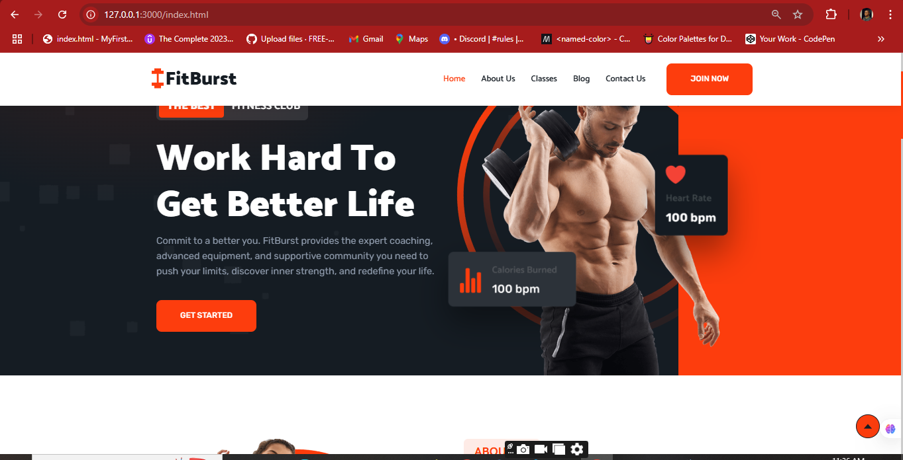

# FitBurst
# FitBurst Gym Website



## Table of Contents

- [About FitBurst](#about-fitburst)
- [Features](#features)
- [Technologies Used](#technologies-used)
- [Installation](#installation)
- [Usage](#usage)
- [Contributing](#contributing)
- [Contact](#contact)

---

## About FitBurst

FitBurst is a vibrant and modern gym dedicated to empowering individuals to achieve their fitness goals and ultimately, "WORK HARD TO GET BETTER LIFE." Our website serves as the central hub for our community, showcasing our offerings, inspiring new members, and providing valuable fitness insights. With a primary color palette featuring energetic orange, the site reflects our passion for vitality and transformation.

---

## Features

This website provides a comprehensive overview of the FitBurst experience:

* **Dynamic Hero Section:** Featuring the motivating slogan "WORK HARD TO GET BETTER LIFE" and a concise brand message.
* **About Us Section:** Introducing "The FitBurst Difference," highlighting our belief in dedication and support, and our vibrant community.
* **Our Sections Overview:** Detailed, concise descriptions for dedicated fitness areas:
    * **Weight Lifting:** Build raw strength and sculpt your physique.
    * **Cardio:** Boost your endurance and heart health.
    * **Strength:** Develop functional power and full-body resilience.
    * **Power Yoga:** Unleash inner power and flexibility.
    * **The Fitness Pack:** (Assumed: Unlocks your complete fitness journey / Offers accelerated results).
* **Engaging Blog Section:** Providing quick, actionable fitness insights and tips, including guidance for first-time gym-goers and form correction.
* **Vibrant Orange Branding:** Consistent use of orange as a primary color throughout the design to convey energy and motivation.
* **Responsive Design:** Optimized for seamless viewing across various devices (desktop, tablet, mobile).
* **Clear Call-to-Actions:** Guiding users to explore offerings and join the FitBurst community.
* **Informative Footer:** Reinforcing the brand with a powerful tagline: "Work Hard. Live Better."

---

## Technologies Used

* **HTML5:** For structuring the web content.
* **CSS3:** For styling and layout (including responsive design and vibrant orange theme).
* **JavaScript:** For interactivity and dynamic elements.

---

## Installation

To get a local copy up and running, follow these simple steps:

1.  **Clone the repository:**
    ```bash
    git clone [https://github.com/Stephen-Garry-Git/fitburst-gym-website.git](https://github.com/Stephen-Garry-Git/fitburst-gym-website.git)
    ```
2.  **Navigate to the project directory:**
    ```bash
    cd fitburst-gym-website
    ```
3.  **Open `index.html` in your web browser:**
    You can simply double-click the `index.html` file or use a live server extension in your code editor (e.g., Live Server for VS Code).

---

## Usage

* **Navigate the Sections:** Use the main navigation menu to explore different parts of the gym's offerings.
* **Read Blog Posts:** Click on blog post snippets to read the full articles (if full articles are implemented).
* **Discover FitBurst:** Learn about our mission and what makes us unique in the "About Us" section.
* **Contact Us:** Find contact information or a form (if implemented) in the footer or a dedicated contact section.

---

## Contributing

Contributions are what make the open-source community such an amazing place to learn, inspire, and create. Any contributions you make are **greatly appreciated**.

1.  Fork the Project
2.  Create your Feature Branch (`git checkout -b feature/AmazingFeature`)
3.  Commit your Changes (`git commit -m 'Add some AmazingFeature'`)
4.  Push to the Branch (`git push origin feature/AmazingFeature`)
5.  Open a Pull Request

---


## Contact

Garry Stephen - [garrystephen605@gmail.com](mailto:garrystephen605@gmail.com)

Project Link: [https://github.com/Stephen-Garry-Git/FitBurst.git](https://github.com/Stephen-Garry-Git/FitBurst.git)

---
